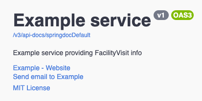

# dps-multi-module-starterkit-java

Java API Starter from Template

## Getting started

Suppose we need a new service to support a new business line.
As a developer, I would like to be able to create a new service quickly, and have all of the common bits already done (for some definition of "common bits").

This is essentially what the starter kit provides: an opinionated starter skeleton which is capable of building a service and deploying it into production.

### Common Bits

At the current stage of development, the "common bits" are:

* Spring-Boot application structure
* Three-tier service architecture
    * API interface with SpringMVC and OpenAPI annotations
    * A Controller class implementing the API interface
    * A Service layer, consisting of:
        * Service Provider Interface (SPI)
        * Provider implementation
    * A Persistence layer
* Unit / Integration testing
* Architectural fitness functions (to enforce 3-tier arch)
* Flyway database migration support
* Code coverage metrics and minimum coverage thresholds
* Build execution time tracking
* Endpoint security via Open Policy Agent
* Kafka support
* Open Telemetry integration
* Gatling load / performance testing
* Model data lifecycle notifications (i.e. data mutation events)
* Documentation support, using MkDocs (deploy to Github Pages)
* OpenAPI v3.0 support for generating docs from code
* Versioning support for dependency updates
* Versioning support for building application
* Helm charts for deployment
* Container support
    * Docker container creation (app, db-init, opa-init)
* Local execution support
    * Docker-Compose definition for running service and dependencies
    * Supporting Postgres, Kafka, Jaeger, OPA, Spring-Boot app

## Dependencies

1. Refer to build requirements in the README.md of the root of this repo
2. Install CookieCutter as per: [https://cookiecutter.readthedocs.io/en/1.7.3/installation.html](https://cookiecutter.readthedocs.io/en/1.7.3/installation.html)
3. Install shellcheck as per: [https://github.com/koalaman/shellcheck#installing](https://github.com/koalaman/shellcheck#installing)
4. Clone the Starter Boot repo
5. In the Starter Boot repo, execute: `./gradlew publishToMavenLocal`

## Generating a new API service

Here is a walk-through of the process for creating a new service skeleton, using a project called bookbinder as an example.

```bash
scripts/generate-resource.sh \
  --repo git+ssh://git@github.com/{{cookiecutter.GITHUB_ORG_NAME}}/dps-multi-module-starterkit-java.git \
  --project bookbinder-api \
  --service bookbinder \
  --output bookbinder-api \
  --resource book \
  --gen-skeleton \
  --gen-resource
```

Or using cookiecutter directly:

```bash
export CC_PROJECT=https://github.com/{{cookiecutter.GITHUB_ORG_NAME}}/dps-multi-module-starterkit-java # (1)
# To build from a local version of the starter kit, replace this value with an absolute path
# e.g. export CC_PROJECT=$PWD/<path>/<to>/dps-multi-module-starterkit-java
export PROJECT_NAME=bookbinder
cookiecutter "${CC_PROJECT}" \
--directory templates/project \
PROJECT_NAME="${PROJECT_NAME}" \
PACKAGE_NAME="${PROJECT_NAME}" \
RESOURCE_VAR_NAME=bindingContract \
projectDir="${CC_PROJECT}" \
--no-input # (2)

cd "${PROJECT_NAME}"

gradlew clean build check docker
gradlew :app:dockerComposeDown :app:dcPrune :app:dockerComposeUp # (3)
```

> 1. If testing locally, set this to the path to your local repo
> 2. RESOURCE_VAR_NAME is the name of the entity under management
> 3. If there are issues with flyway migrations, pruning the docker volumes may resolve them: `./gradlew :app:dcPruneVolume`
>
> Note: Any time you are pulling artifacts from the Github packages repository, it is likely that you will need to specify your authorizations.
> Typically, we run the build behind `secrethub` to obtain the necessary credentials for Github Packages.
>
> ```bash
> secrethub run -- gradlew clean build check docker
> ```
>
> You may also be required to use a Personal Access Token in lieu of your password.

## Verify the app is running

```bash
curl localhost:8081/actuator/health
curl localhost:8081/actuator/info
```

## Example endpoints

When the app starts, the database is created (migrated via Flyway) but not seeded - meaning the tables are set up, but not populated with data.
Running the Gatling load tests populates data in the table(s) by making POST requests to Create endpoints.

### Create a resource

```bash
curl -i -d '{
               "userName": "mary.q.contrary",
               "pii": "987-65-4321",
               "firstName": "Mary",
               "lastName": "Contrary"
       }' \
       -H 'Content-Type: application/json' \
       -X POST \
       localhost:8080/v1/example/facilityvisits
```

### Fetch a resource

```bash
curl -i localhost:8080/v1/example/facilityvisits/<id-from-previous-response>
```

### Fetch a list of all resources

```bash
curl localhost:8080/v1/example/facilityvisits
```

### Update a resource

```bash
curl -i -d '{
    "userName": "newUserName",
    "pii": "12356789",
    "firstName": "newFirstName",
    "lastName": "Contrary"
  }' \
  -H 'Content-Type: application/json' \
  -X PUT \
  localhost:8080/v1/example/facilityvisits/<id-from-previous-response>
```

### Delete a resource

```bash
curl -i -X DELETE localhost:8080/v1/example/facilityvisits/<id-from-previous-response>
```

## Load/Performance Tests

In order to see the system working, attach a consumer to the Kafka queue.
Then run the performance test to generate traffic.

```bash
scripts/consume-kafka.sh # <--- run this in a separate window
gradlew :app:gatlingRun  
```

The console output of the Gatling tests will provide a link to a browser view with details on the tests, e.g.

```text
Reports generated in 0s.
Please open the following file: /<path>/<to>/<project>/app/build/reports/gatling/<api-name>simulation-<timestamp>/index.html
== CSV Build Time Summary ==
Build time today: 6:50.347
Total build time: 6:50.347
(measured since 8 minutes ago)
```

## OpenAPI Spec

View the OpenAPI documentation for your service by navigating to [http://localhost:8080/swagger](http://localhost:8080/swagger) in your browser.

The links in the header section can be configured using the `starter.openapi` properties located in `/app/src/main/resources/application.yml`.



```bash
chrome http://localhost:8080/swagger
```

## Tracing

View the Jaeger monitoring system

```bash
chrome http://localhost:16686/
```
